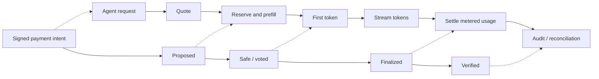
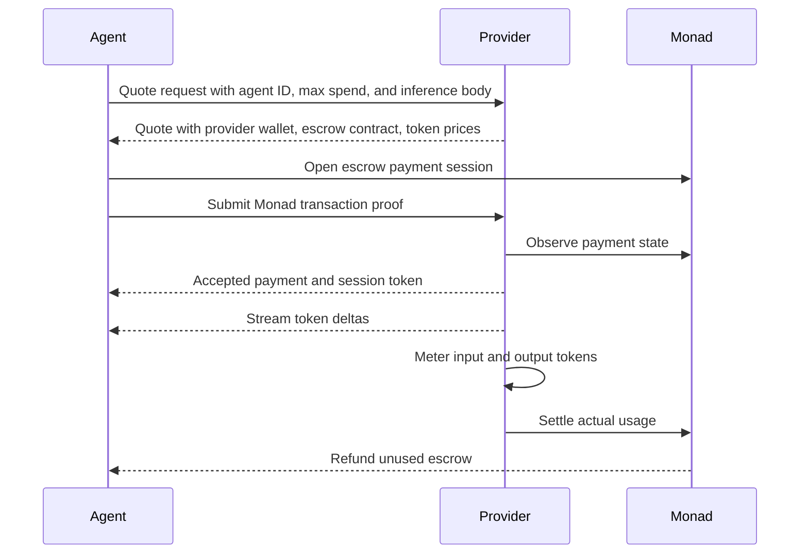

# Monad MPP-I Specification Sketch

MPP-I is a machine payment pattern for metered, streaming inference on Monad.

The protocol is designed around a simple observation: inference is not a static download. It has an identity gate, a prefill phase, a first-token latency target, a streaming phase, final usage accounting, and refund semantics. MPP-I maps those inference stages onto Monad payment states so providers can start work before waiting for final accounting.

This document is a public sketch. It describes the intended protocol surface and does not include private demo code, private deployment addresses, or provider infrastructure.

## Goals

- Let agents buy inference from providers without API keys or subscriptions.
- Let providers price input and output tokens per request.
- Let agents escrow a maximum spend before inference starts.
- Let providers begin safe compute when payment reaches Monad `Proposed` state.
- Let providers stream tokens while metering usage.
- Let final settlement charge only actual usage and refund unused escrow.

## Non-Goals

- This sketch does not define wallet custody or key management.
- This sketch does not standardize every model-provider request field.
- This sketch does not claim trust-minimized token metering. Provider-side metering is the first public design target.
- This sketch does not include production dispute handling.

## Actors

- **Agent**: autonomous caller requesting inference and paying from a wallet.
- **Inference provider**: service that prices, serves, meters, and settles inference.
- **Monad**: settlement layer that exposes payment state transitions.
- **MPP-I SDK**: client-side integration surface for quote, proof, and stream handling.

## State Mapping



`Proposed` is the key Monad-native primitive. It lets a provider reserve capacity and start prefill while payment risk is still moving through the chain. The provider can choose its own risk threshold for first-token delivery.

## Agent Flow



## Endpoint Shape

MPP-I uses three logical endpoints.

### Quote

`POST /v1/mpp-i/quotes`

The agent sends:

- `agent_id`
- `max_spend_wei`
- chat or inference request body

The provider returns:

- `session_id`
- `agent_id`
- `provider_wallet`
- `escrow_contract`
- `chain_id`
- `max_spend_wei`
- `price_per_input_token_wei`
- `price_per_output_token_wei`
- initial `payment_state`

### Payment Proof

`POST /v1/mpp-i/payment-proofs`

The agent sends:

- `session_id`
- `agent_id`
- proof type
- Monad transaction hash

The provider verifies that the payment intent matches the quote and returns a short-lived `session_token` once the payment state is acceptable.

### Streaming Inference

`POST /v1/mpp-i/chat/completions`

The agent sends the inference request with the accepted session token. The provider streams newline-delimited JSON events such as:

- `stream.start`
- `token.delta`
- `usage`
- `stream.done`
- `error`

## Settlement

The provider meters:

- input tokens
- output tokens
- price per input token
- price per output token

The settlement amount is:

```text
amount_due = input_tokens * price_per_input_token + output_tokens * price_per_output_token
refund = max_spend - amount_due
```

The first public design assumes trusted provider-side metering. Later versions can add signed receipts, verifiable metering, dispute windows, or provider staking.

## Security Notes

- Agents should cap `max_spend_wei` per request.
- Providers should reject expired quotes and replayed sessions.
- Providers should not store raw prompts or raw outputs onchain.
- Public identity fields should be treated as linkable unless they are salted commitments.
- Session tokens should be short-lived and single-use.
- Wallet signing stays in the agent application's custody layer, not in this SDK sketch.
